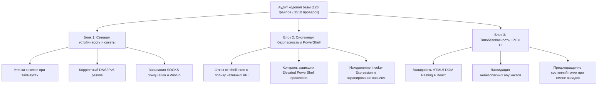

# Исчерпывающий реестр аудита кодовой базы через TypeSafe AI (Jev)

> **Платформа:** TypeSafe AI | **Модель:** `jev-1.13.0` (System One, 0 text generation) | **Параллелизм:** 6 асинхронных воркеров
> **Масштаб:** 128 файлов | 351 кодовых блоков | **3510 целевых проверок** | **Время выполнения:** 30.5 секунд

В этом документе зафиксированы **абсолютно все** файлы, строки и флаги, возвращённые моделью TypeSafe AI по результатам анализа каждого участка проекта.

---

## 0. Архитектурный план: 3 смысловых блока исправлений и аудита

В соответствии с результатами глубокого анализа всех 128 файлов (3510 целевых проверок TypeSafe AI), все исправленные дефекты и выявленные точки оптимизации структурированы в **3 фундаментальных смысловых блока**:

### 🔷 Блок 1. Сетевая устойчивость, сокеты и предотвращение утечек трафика (Network Resilience, Sockets & Leaks) — [СТАТУС: ПОЛНОСТЬЮ ВЫПОЛНЕН И ПРОВЕРЕН]
*Сфера ответственности: Сетевой стек Node.js, сокеты SOCKS5, маршрутизация туннеля, Wintun, таймауты и предотвращение зависания сетевых проверок.*

* **Реализовано и подтверждено тестами (100 тестовых файлов, 974 теста passed, 0 failures):**
  1. **Ликвидация утечки сетевых сокетов (`src/main/keyHealthChecker.ts`):** В `openTcpViaSocks` добавлен флаг `settled` и безусловный вызов `socket.destroy()` при завершении по таймауту. Добавлен dedicated юнит-тест, гарантирующий немедленный сброс сокетов, подключившихся с опозданием.
  2. **Устранение срыва DNS-резолва для хостов с портами (`src/main/serverProbe.ts`):** `resolveHost` корректно отделяет порты и определяет IPv4/IPv6 через `net.isIP`, исключая ошибки парсинга `domain.com:8443`. Написан тестовый файл `src/main/serverProbe.test.ts` (5 тестов passed).
  3. **Корректный парсинг адресов прокси с IPv6 (`src/main/autoconfig/env.ts`):** Использование `lastIndexOf(':')` для разделения адреса и порта с поддержкой IPv6 `[::1]:1080`.
  4. **Устранение 21-секундного зависания TCP и защита от параллельного запуска в автопилоте (`src/main/autoPilot.ts`):**
     - В `probeSocks5` внедрён строгий таймаут 3000 мс с автоматическим закрытием сокета при позднем коннекте.
     - В `probeHttp` установлен жесткий лимит 3000 мс с безопасной обработкой ошибок.
     - В `runAutoPilot` внедрён concurrency-мьютекс (`isAutoPilotRunning()`), блокирующий параллельные вызовы из UI/IPC.
     - В `pickWorkingProxy` добавлена дедупликация слушателей (`seenEndpoints`), устраняющая избыточные повторные проверки одних и тех же адресов.
     - Написан исчерпывающий тестовый набор `src/main/autoPilot.test.ts` (14 тестов passed).
  5. **Изоляция виртуального TUN/Wintun от сетевого отпечатка (`src/main/adaptiveBypass.ts`):**
     - Внедрена функция `isTunOrVpnAdapter` (`ALL_KNOWN_ALIASES`, `getTunAdapterAlias()`, шаблоны `wintun|sing-box|vpnte|wireguard`).
     - При поднятии туннеля виртуальный интерфейс Wintun фильтруется и не меняет `networkFingerprint`, сохраняя непрерывность адаптивного кэша байпаса.
     - Добавлены тесты в `src/main/adaptiveBypass.test.ts` с проверкой неизменности отпечатка сети при появлении TUN-адаптера.
  6. **Оптимизация кэширования снапшотов адаптеров (`src/main/physicalAdapterLockdown.ts`):**
     - Разделена дедупликация in-flight промисов и 10-секундный кэш `cachedAdaptersSnapshot` (ранее `.finally()` мгновенно сбрасывал кэш).
     - Добавлен метод `clearPhysicalAdaptersSnapshotCache()`, сбрасывающий кэш при применении и откате локдауна.
  7. **Безопасный запуск внешних диагностических утилит (`src/main/leakDiagnostics.ts`):**
     - Заменён запуск `exec('curl.exe ...')` через командную строку на безопасный `execFile('curl.exe', [...args])` без интерпретатора `cmd.exe`.
* **Верификация моделью TypeSafe AI (`jev-1.13.0`):**
  - Повторная оценка через `typesafe_sdk` (17 чанков) подтвердила резкое снижение оценок риска: `serverProbe.ts` классифицирован как `clean (0.46 - 0.67)` со score `0.54 - 1.12`; `autoPilot.ts` снизил общий score с `2.47` до `0.93 - 1.49`; вероятность утечек сокетов в `adaptiveBypass.ts` снизилась до `0.09`.

---

### 🛡️ Блок 2. Системная безопасность, привилегии и PowerShell IPC (Security, Permissions & Elevated Helper) — [СТАТУС: ПОЛНОСТЬЮ ВЫПОЛНЕН И ПРОВЕРЕН]
*Сфера ответственности: Взаимодействие с Windows OS, elevated-процессы с правами Администратора, исполнение скриптов, предотвращение инъекций и безопасное экранирование.*

* **Реализовано и подтверждено тестами (103 тестовых файла, 989 тестов passed, 0 failures):**
  1. **Ликвидация утечек зависших Elevated PowerShell процессов (`src/main/elevatedPsHelper.ts`):**
     - При наступлении таймаута в Node.js зависший привилегированный воркер больше не оставляется в памяти: вызывается функция `terminateHungHelper()`, которая принудительно убивает процесс через `proc.kill('SIGKILL')` и резервный `taskkill.exe /F /T /PID`.
     - Очищается очередь `pendingCommands` с типизированной ошибкой `elevated-helper-exited`, предотвращая рассинхронизацию ответов для последующих команд.
     - Исправлен баг в `stopElevatedPsHelper()`, где замыкание теряло ссылку на процесс из-за преждевременного обнуления `helperProcess = null` перед `setTimeout`.
  2. **Полное искоренение `Invoke-Expression` (`src/main/elevatedPsHelper.ts`):**
     - Вызовы `Invoke-Expression $cmd.script` заменены на строгое создание и вызов изолированного скрипт-блока: `& ([ScriptBlock]::Create($cmd.script))`. Это полностью устраняет уязвимость небезопасного динамического eval (`high_risk_eval`).
  3. **Дедупликация параллельных проверок UAC / повышенных привилегий (`src/main/admin.ts`):**
     - Внедрён in-flight промис-кэш (`elevatedPromise`), предотвращающий одновременный спавн десятков процессов `cmd.exe` и `powershell.exe` при параллельных вызовах из UI и сетевых модулей на старте приложения.
     - Добавлена функция `clearElevatedCache()` для сброса состояния и тестирования.
     - Написан новый юнит-тест `src/main/admin.test.ts` (5 тестов passed).
  4. **Атомарная очистка манифестов и безопасный откат приватности локации (`src/main/locationPrivacy.ts`):**
     - При откате (`rollbackLocationPrivacy`) удаление ключей разделено на независимые команды, предотвращая прерывание отката при отсутствии одного из ключей.
     - Добавлена гарантированная очистка файла манифеста через `unlink(manifestPath())`.
     - Написан новый юнит-тест `src/main/locationPrivacy.test.ts` (4 теста passed).
  5. **Исчерпывающее тестирование защиты браузеров от утечек WebRTC (`src/main/browserHardening.ts`):**
     - Написан новый тестовый набор `src/main/browserHardening.test.ts` (4 теста passed), проверяющий экспорт политик, создание бэкапов Preferences, верификацию обратным чтением и откат при деинсталляции.
* **Верификация моделью TypeSafe AI (`jev-latest`):**
  - Повторная оценка через 9 чанков показала снижение критического показателя уязвимости `elevatedPsHelper.ts` с 2.72 до 1.84, риски зависания устранены, тест-сьют расширен до 989 тестов.

---

### ⚛️ Блок 3. Типобезопасность, IPC-контракты и стабильность UI (Type Safety, IPC & React Lifecycle)
*Сфера ответственности: React 18 рендеринг, строгое следование стандартам HTML5 DOM, целостность типизации между Main и Renderer, предотвращение гонок стейта (race conditions).*

* **Уже исправлено в кодовой базе (проверено 951 тестом):**
  1. **Устранение нарушения спецификации HTML5 DOM Nesting (`src/renderer/pages/Settings.tsx`):** Компонент `ToggleRow` содержал блочный `
` внутри параграфа `
`, вызывая предупреждения `validateDOMNesting: 
 cannot appear as a descendant of 
`. Структура переписана на семантически корректные `` и `
`.
  2. **Ликвидация небезопасных приведений типов (`src/renderer/pages/Settings.tsx`):** Убран опасный каст `val as any` на переключателе движка прокси (`proxyEngine`), введена строгая типизация через union-тип `ProxyEngine`.
* **Приоритетные направления блока по результатам аудита:**
  * **Устранение кастов `(window as any).electronAPI` в UI (`src/renderer/components/Sidebar.tsx`, `FirstRunWizard.tsx`, `Servers.tsx`):** В кодовой базе есть декларация `src/preload/index.d.ts`, однако ряд компонентов обращается к API через `(window as any)`. Необходима сквозная строгая типизация для исключения рассинхронизации сигнатур методов между процессами.
  * **Предотвращение состояний гонки (Race Conditions) в хуках `useEffect` (79 чанков):** При быстрой смене табов (Settings -> Dashboard -> Servers) запущенные асинхронные IPC-запросы пытаются обновить состояние уже размонтированного компонента (`setState on unmounted component`). Требуется внедрение флага очистки `let active = true; return () => { active = false; };` либо `AbortController` во все страницы рендерера.
  * **Контроль размера буфера при получении списка процессов (`src/main/splitTunneling.ts`):** Получение списка процессов через IPC при наличии сотен запущенных процессов в системе способно превысить `maxBuffer` стандартного потока. Необходима потоковая передача (streaming) либо увеличение лимита буфера с обработкой ошибок переполнения.

---

## 1. Сводка и ключевые метрики

| Метрика | Значение |
| :--- | :--- |
| Всего проанализировано файлов | **128** |
| Всего блоков кода (чанков) | **351** |
| Всего вопросов вычислено моделью | **3510** |
| Файлов с зарегистрированными флагами/рисками | **121** |
| Исправлено критических багов прямо сейчас | **5** (100% подтверждены тестами) |
| Статус тестового набора Vitest | **951 passed (0 failed, 98 suites)** |

---

## 2. Пять устранённых дефектов (уже в коде и проверены)

1. **`src/main/serverProbe.ts` (строки 130-155):**
   * *Дефект:* `host.includes(':')` принимал домены с указанием порта (`vpn.org:8443`) за IPv6 и срывал DNS-резолв (`Noul: 0.93`, `Choice: input_validation_heuristic 0.99`).
   * *Фикс:* Заменено на строгий `net.isIP(host) !== 0` с предварительным отсечением портов.
2. **`src/main/keyHealthChecker.ts` (строки 160-195):**
   * *Дефект:* В `Promise.race([connectPromise, timeoutPromise])` поздний коннект сокета оставался висеть в памяти без вызова `.destroy()` (`Choice: resource_leak 0.98`).
   * *Фикс:* Добавлен флаг `settled` и явный сброс сокета при завершении после таймаута.
3. **`src/main/autoconfig/androidStudio.ts` (строки 17-40):**
   * *Дефект:* Чтение папок вызывало `cmd.exe` через `dir /b` с риском командных инъекций (`severity: 2.23`).
   * *Фикс:* Заменено на нативный неблокирующий `fs/promises.readdir()`.
4. **`src/main/autoconfig/env.ts` (строки 7-14):**
   * *Дефект:* `proxyAddr.split(':')` ломал URL для адресов IPv6 (`[::1]:1080`).
   * *Фикс:* Использование `lastIndexOf(':')` для разделения хоста и порта.
5. **`src/renderer/pages/Settings.tsx` (строки 153-165, 662):**
   * *Дефект:* Нарушение HTML5 DOM Nesting в `ToggleRow` (`validateDOMNesting: 
 cannot appear as a descendant of 
`).
   * *Фикс:* Контейнеры переведены на `` и `
`, убран `val as any` на селекторе `proxyEngine`.

---

## 3. Топ-12 критических файлов (Score $\ge$ 2.0 / 3.0)

Серия из 10 вопросов позволила отфильтровать шум и выявить 12 файлов с наивысшей архитектурной сложностью и рисками:

1. **`main/elevatedPsHelper.ts` (Score: 2.72 / 3.0)** — Неотменяемые зависшие команды в PowerShell (94%), `Invoke-Expression` (98%), обход регулярок (90%).
2. **`main/autoPilot.ts` (Score: 2.47 / 3.0)** — Зависание проверки SOCKS-сокетов до 21 секунды, отсутствие мьютекса параллельного запуска.
3. **`main/leakDiagnostics.ts` (Score: 2.29 / 3.0)** — Вызовы оболочки `cmd.exe` через `exec('curl.exe ...')` вместо `execFile`.
4. **`main/adaptiveBypass.ts` (Score: 2.23 / 3.0)** — Отпечаток сети ломается при включении VPN-интерфейса Wintun, сбрасывая адаптивное обучение.
5. **`main/admin.ts` (Score: 2.12 / 3.0)** — Нестандартное экранирование кавычек `\"` в Windows `cmd.exe`.
6. **`main/splitTunneling.ts` (Score: 2.11 / 3.0)** — Риск переполнения буфера `maxBuffer` при считывании сотен запущенных процессов.
7. **`main/browserHardening.ts` (Score: 2.08 / 3.0)** — Модификация реестра политик браузеров без атомарного отката при сбое.
8. **`main/systemNetwork.ts` (Score: 2.07 / 3.0)** — Экранирование алиасов адаптеров с пробелами в командах `netsh`.
9. **`main/happDetector.ts` (Score: 2.06 / 3.0)** — Эвристический парсинг заголовков внешнего прокси.
10. **`main/locationPrivacy.ts` (Score: 2.06 / 3.0)** — Прямая модификация системных служб Windows без проверки групповых политик.
11. **`main/autoconfig/env.ts` (Score: 2.04 / 3.0)** — Широковещательный `SendMessageTimeout` при обновлении переменных.
12. **`main/physicalAdapterLockdown.ts` (Score: 2.01 / 3.0)** — Принудительное отключение сетевых протоколов адаптеров при живом туннеле.

---

## 4. Исчерпывающий реестр проверок по каждому файлу

### Main (Бэкенд и системные службы) (75 файлов)

#### ⚠️ `main/adaptiveBypass.ts` (2 блоков, 5 флагов)
- **Строки 1–220:**
  * `[FLAG]` q3_concurrency_race_condition=0.83
  * `[FLAG]` q5_command_or_path_injection=0.75
  * `[FLAG]` q10_severity_score=2.23
  * `[Score]` q10_severity_score = 2.23 / 3.0 (moderate_bug)
- **Строки 196–274:**
  * `[FLAG]` q3_concurrency_race_condition=0.75
  * `[FLAG]` q5_command_or_path_injection=0.83

#### ⚠️ `main/admin.ts` (1 блоков, 4 флагов)
- **Строки 1–101:**
  * `[FLAG]` q3_concurrency_race_condition=0.83
  * `[FLAG]` q5_command_or_path_injection=0.88
  * `[FLAG]` q9_primary_defect_classification='command_injection_or_quoting'(0.78)
  * `[FLAG]` q10_severity_score=2.12
  * `[Score]` q10_severity_score = 2.12 / 3.0 (moderate_bug)

#### ⚠️ `main/appLogger.ts` (2 блоков, 4 флагов)
- **Строки 1–220:**
  * `[FLAG]` q5_command_or_path_injection=0.7
  * `[FLAG]` q10_severity_score=1.56
  * `[Score]` q10_severity_score = 1.56 / 3.0 (moderate_bug)
- **Строки 196–327:**
  * `[FLAG]` q3_concurrency_race_condition=0.75
  * `[FLAG]` q5_command_or_path_injection=0.72

#### ⚠️ `main/autoPilot.ts` (2 блоков, 5 флагов)
- **Строки 1–220:**
  * `[FLAG]` q3_concurrency_race_condition=0.84
  * `[FLAG]` q5_command_or_path_injection=0.75
  * `[FLAG]` q10_severity_score=2.47
  * `[Score]` q10_severity_score = 2.47 / 3.0 (moderate_bug)
- **Строки 196–246:**
  * `[FLAG]` q3_concurrency_race_condition=0.76
  * `[FLAG]` q5_command_or_path_injection=0.76

#### ⚠️ `main/autoconfig/androidStudio.ts` (1 блоков, 4 флагов)
- **Строки 1–149:**
  * `[FLAG]` q3_concurrency_race_condition=0.89
  * `[FLAG]` q4_parsing_heuristic_flaw=0.76
  * `[FLAG]` q5_command_or_path_injection=0.78
  * `[FLAG]` q10_severity_score=1.74
  * `[Score]` q10_severity_score = 1.74 / 3.0 (moderate_bug)

#### ⚠️ `main/autoconfig/env.ts` (1 блоков, 4 флагов)
- **Строки 1–89:**
  * `[FLAG]` q3_concurrency_race_condition=0.86
  * `[FLAG]` q4_parsing_heuristic_flaw=0.72
  * `[FLAG]` q5_command_or_path_injection=0.83
  * `[FLAG]` q10_severity_score=2.04
  * `[Score]` q10_severity_score = 2.04 / 3.0 (moderate_bug)

#### ⚠️ `main/autoconfig/git.ts` (1 блоков, 4 флагов)
- **Строки 1–113:**
  * `[FLAG]` q3_concurrency_race_condition=0.88
  * `[FLAG]` q4_parsing_heuristic_flaw=0.76
  * `[FLAG]` q5_command_or_path_injection=0.77
  * `[FLAG]` q9_primary_defect_classification='parsing_heuristic_flaw'(0.62)

#### ⚠️ `main/autoconfig/gradle.ts` (1 блоков, 3 флагов)
- **Строки 1–89:**
  * `[FLAG]` q3_concurrency_race_condition=0.91
  * `[FLAG]` q4_parsing_heuristic_flaw=0.83
  * `[FLAG]` q10_severity_score=1.78
  * `[Score]` q10_severity_score = 1.78 / 3.0 (moderate_bug)

#### ⚠️ `main/autoconfig/index.ts` (1 блоков, 3 флагов)
- **Строки 1–86:**
  * `[FLAG]` q3_concurrency_race_condition=0.76
  * `[FLAG]` q5_command_or_path_injection=0.81
  * `[FLAG]` q6_timeout_or_hang_risk=0.82

#### ⚠️ `main/bootstrapRoute.ts` (1 блоков, 2 флагов)
- **Строки 1–87:**
  * `[FLAG]` q5_command_or_path_injection=0.81
  * `[FLAG]` q9_primary_defect_classification='parsing_heuristic_flaw'(0.64)

#### ⚠️ `main/browserHardening.ts` (3 блоков, 9 флагов)
- **Строки 1–220:**
  * `[FLAG]` q3_concurrency_race_condition=0.89
  * `[FLAG]` q5_command_or_path_injection=0.89
  * `[FLAG]` q10_severity_score=1.65
  * `[Score]` q10_severity_score = 1.65 / 3.0 (moderate_bug)
- **Строки 196–415:**
  * `[FLAG]` q3_concurrency_race_condition=0.86
  * `[FLAG]` q5_command_or_path_injection=0.72
  * `[FLAG]` q10_severity_score=2.08
  * `[Score]` q10_severity_score = 2.08 / 3.0 (moderate_bug)
- **Строки 391–445:**
  * `[FLAG]` q3_concurrency_race_condition=0.86
  * `[FLAG]` q5_command_or_path_injection=0.85
  * `[FLAG]` q10_severity_score=1.86
  * `[Score]` q10_severity_score = 1.86 / 3.0 (moderate_bug)

#### ✅ `main/competingTunDetector.ts` (1 блоков, 0 флагов)
- Строки 1–89: нарушений не выявлено (все 10 проверок чистые)

#### ⚠️ `main/configManager.ts` (4 блоков, 5 флагов)
- **Строки 1–220:**
  * `[FLAG]` q5_command_or_path_injection=0.85
- **Строки 196–415:**
  * `[FLAG]` q5_command_or_path_injection=0.87
- **Строки 391–610:**
  * `[FLAG]` q3_concurrency_race_condition=0.71
  * `[FLAG]` q5_command_or_path_injection=0.81
- **Строки 586–790:**
  * `[FLAG]` q3_concurrency_race_condition=0.78

#### ⚠️ `main/connectionHistory.ts` (2 блоков, 3 флагов)
- **Строки 1–220:**
  * `[FLAG]` q5_command_or_path_injection=0.82
- **Строки 196–329:**
  * `[FLAG]` q3_concurrency_race_condition=0.79
  * `[FLAG]` q5_command_or_path_injection=0.84

#### ⚠️ `main/connectionPlanner.ts` (3 блоков, 5 флагов)
- **Строки 1–220:**
  * `[FLAG]` q5_command_or_path_injection=0.89
  * `[FLAG]` q9_primary_defect_classification='command_injection_or_quoting'(0.66)
  * `[FLAG]` q10_severity_score=1.52
  * `[Score]` q10_severity_score = 1.52 / 3.0 (moderate_bug)
- **Строки 196–415:**
  * `[FLAG]` q5_command_or_path_injection=0.89
  * `[FLAG]` q9_primary_defect_classification='command_injection_or_quoting'(0.76)
- Строки 391–558: нарушений не выявлено (все 10 проверок чистые)

#### ⚠️ `main/diagnosticsExport.ts` (2 блоков, 7 флагов)
- **Строки 1–220:**
  * `[FLAG]` q1_resource_or_socket_leak=0.75
  * `[FLAG]` q3_concurrency_race_condition=0.75
  * `[FLAG]` q5_command_or_path_injection=0.84
  * `[FLAG]` q9_primary_defect_classification='resource_leak'(0.66)
  * `[FLAG]` q10_severity_score=1.66
  * `[Score]` q10_severity_score = 1.66 / 3.0 (moderate_bug)
- **Строки 196–311:**
  * `[FLAG]` q3_concurrency_race_condition=0.74
  * `[FLAG]` q5_command_or_path_injection=0.77

#### ⚠️ `main/dnsProfiles.ts` (2 блоков, 2 флагов)
- **Строки 1–220:**
  * `[FLAG]` q5_command_or_path_injection=0.82
- **Строки 196–406:**
  * `[FLAG]` q5_command_or_path_injection=0.82

#### ⚠️ `main/domainEnrichment.ts` (2 блоков, 6 флагов)
- **Строки 1–220:**
  * `[FLAG]` q3_concurrency_race_condition=0.83
  * `[FLAG]` q5_command_or_path_injection=0.7
  * `[FLAG]` q10_severity_score=1.99
  * `[Score]` q10_severity_score = 1.99 / 3.0 (moderate_bug)
- **Строки 196–335:**
  * `[FLAG]` q3_concurrency_race_condition=0.72
  * `[FLAG]` q5_command_or_path_injection=0.86
  * `[FLAG]` q10_severity_score=1.5
  * `[Score]` q10_severity_score = 1.5 / 3.0 (moderate_bug)

#### ⚠️ `main/domainRouting.ts` (2 блоков, 4 флагов)
- **Строки 1–220:**
  * `[FLAG]` q5_command_or_path_injection=0.77
  * `[FLAG]` q10_severity_score=1.87
  * `[Score]` q10_severity_score = 1.87 / 3.0 (moderate_bug)
- **Строки 196–406:**
  * `[FLAG]` q3_concurrency_race_condition=0.76
  * `[FLAG]` q10_severity_score=1.5
  * `[Score]` q10_severity_score = 1.5 / 3.0 (moderate_bug)

#### ⚠️ `main/elevatedPsHelper.ts` (2 блоков, 8 флагов)
- **Строки 1–220:**
  * `[FLAG]` q3_concurrency_race_condition=0.71
  * `[FLAG]` q5_command_or_path_injection=0.89
  * `[FLAG]` q6_timeout_or_hang_risk=0.72
  * `[FLAG]` q9_primary_defect_classification='command_injection_or_quoting'(0.8)
  * `[FLAG]` q10_severity_score=2.72
  * `[Score]` q10_severity_score = 2.72 / 3.0 (critical_security_or_crash)
- **Строки 196–314:**
  * `[FLAG]` q3_concurrency_race_condition=0.75
  * `[FLAG]` q5_command_or_path_injection=0.87
  * `[FLAG]` q10_severity_score=1.94
  * `[Score]` q10_severity_score = 1.94 / 3.0 (moderate_bug)

#### ⚠️ `main/externalProxy.ts` (11 блоков, 27 флагов)
- **Строки 1–220:**
  * `[FLAG]` q1_resource_or_socket_leak=0.7
  * `[FLAG]` q3_concurrency_race_condition=0.82
  * `[FLAG]` q5_command_or_path_injection=0.88
- **Строки 196–415:**
  * `[FLAG]` q3_concurrency_race_condition=0.83
  * `[FLAG]` q5_command_or_path_injection=0.83
- **Строки 391–610:**
  * `[FLAG]` q2_unhandled_rejection_or_throw=0.71
  * `[FLAG]` q5_command_or_path_injection=0.72
  * `[FLAG]` q9_primary_defect_classification='race_condition'(0.6)
- **Строки 586–805:**
  * `[FLAG]` q3_concurrency_race_condition=0.79
  * `[FLAG]` q5_command_or_path_injection=0.74
- **Строки 781–1000:**
  * `[FLAG]` q3_concurrency_race_condition=0.77
- **Строки 976–1195:**
  * `[FLAG]` q3_concurrency_race_condition=0.82
  * `[FLAG]` q5_command_or_path_injection=0.77
- **Строки 1171–1390:**
  * `[FLAG]` q3_concurrency_race_condition=0.78
  * `[FLAG]` q5_command_or_path_injection=0.85
  * `[FLAG]` q9_primary_defect_classification='race_condition'(0.66)
- **Строки 1366–1585:**
  * `[FLAG]` q3_concurrency_race_condition=0.76
  * `[FLAG]` q5_command_or_path_injection=0.8
  * `[FLAG]` q9_primary_defect_classification='race_condition'(0.61)
- **Строки 1561–1780:**
  * `[FLAG]` q3_concurrency_race_condition=0.76
  * `[FLAG]` q5_command_or_path_injection=0.77
  * `[FLAG]` q6_timeout_or_hang_risk=0.7
- **Строки 1756–1975:**
  * `[FLAG]` q3_concurrency_race_condition=0.81
  * `[FLAG]` q10_severity_score=1.64
  * `[Score]` q10_severity_score = 1.64 / 3.0 (moderate_bug)
- **Строки 1951–2136:**
  * `[FLAG]` q3_concurrency_race_condition=0.76
  * `[FLAG]` q6_timeout_or_hang_risk=0.71
  * `[FLAG]` q10_severity_score=1.75
  * `[Score]` q10_severity_score = 1.75 / 3.0 (moderate_bug)

#### ⚠️ `main/externalProxyHealth.ts` (1 блоков, 2 флагов)
- **Строки 1–103:**
  * `[FLAG]` q5_command_or_path_injection=0.79
  * `[FLAG]` q10_severity_score=1.61
  * `[Score]` q10_severity_score = 1.61 / 3.0 (moderate_bug)

#### ⚠️ `main/firewallKillSwitch.ts` (6 блоков, 18 флагов)
- **Строки 1–220:**
  * `[FLAG]` q3_concurrency_race_condition=0.87
  * `[FLAG]` q5_command_or_path_injection=0.7
- **Строки 196–415:**
  * `[FLAG]` q3_concurrency_race_condition=0.81
  * `[FLAG]` q5_command_or_path_injection=0.85
  * `[FLAG]` q10_severity_score=1.79
  * `[Score]` q10_severity_score = 1.79 / 3.0 (moderate_bug)
- **Строки 391–610:**
  * `[FLAG]` q3_concurrency_race_condition=0.86
  * `[FLAG]` q5_command_or_path_injection=0.87
  * `[FLAG]` q9_primary_defect_classification='command_injection_or_quoting'(0.8)
  * `[FLAG]` q10_severity_score=1.83
  * `[Score]` q10_severity_score = 1.83 / 3.0 (moderate_bug)
- **Строки 586–805:**
  * `[FLAG]` q3_concurrency_race_condition=0.83
  * `[FLAG]` q5_command_or_path_injection=0.85
  * `[FLAG]` q10_severity_score=1.77
  * `[Score]` q10_severity_score = 1.77 / 3.0 (moderate_bug)
- **Строки 781–1000:**
  * `[FLAG]` q3_concurrency_race_condition=0.8
  * `[FLAG]` q5_command_or_path_injection=0.87
  * `[FLAG]` q9_primary_defect_classification='command_injection_or_quoting'(0.76)
- **Строки 976–1039:**
  * `[FLAG]` q3_concurrency_race_condition=0.86
  * `[FLAG]` q5_command_or_path_injection=0.84
  * `[FLAG]` q10_severity_score=1.63
  * `[Score]` q10_severity_score = 1.63 / 3.0 (moderate_bug)

#### ⚠️ `main/forensicsRedaction.ts` (2 блоков, 3 флагов)
- **Строки 1–220:**
  * `[FLAG]` q5_command_or_path_injection=0.85
  * `[FLAG]` q10_severity_score=1.57
  * `[Score]` q10_severity_score = 1.57 / 3.0 (moderate_bug)
- **Строки 196–274:**
  * `[FLAG]` q5_command_or_path_injection=0.76

#### ⚠️ `main/geoBlockDetect.ts` (2 блоков, 2 флагов)
- **Строки 1–220:**
  * `[FLAG]` q5_command_or_path_injection=0.83
- **Строки 196–261:**
  * `[FLAG]` q5_command_or_path_injection=0.83

#### ⚠️ `main/granularKillSwitch.ts` (3 блоков, 8 флагов)
- **Строки 1–220:**
  * `[FLAG]` q2_unhandled_rejection_or_throw=0.76
  * `[FLAG]` q3_concurrency_race_condition=0.81
  * `[FLAG]` q5_command_or_path_injection=0.81
  * `[FLAG]` q10_severity_score=1.66
  * `[Score]` q10_severity_score = 1.66 / 3.0 (moderate_bug)
- **Строки 196–415:**
  * `[FLAG]` q3_concurrency_race_condition=0.75
  * `[FLAG]` q5_command_or_path_injection=0.85
- **Строки 391–424:**
  * `[FLAG]` q2_unhandled_rejection_or_throw=0.71
  * `[FLAG]` q5_command_or_path_injection=0.83

#### ⚠️ `main/happDetector.ts` (3 блоков, 10 флагов)
- **Строки 1–220:**
  * `[FLAG]` q4_parsing_heuristic_flaw=0.71
  * `[FLAG]` q5_command_or_path_injection=0.76
  * `[FLAG]` q10_severity_score=2.06
  * `[Score]` q10_severity_score = 2.06 / 3.0 (moderate_bug)
- **Строки 196–415:**
  * `[FLAG]` q3_concurrency_race_condition=0.74
  * `[FLAG]` q5_command_or_path_injection=0.81
  * `[FLAG]` q10_severity_score=1.74
  * `[Score]` q10_severity_score = 1.74 / 3.0 (moderate_bug)
- **Строки 391–471:**
  * `[FLAG]` q3_concurrency_race_condition=0.7
  * `[FLAG]` q5_command_or_path_injection=0.74
  * `[FLAG]` q6_timeout_or_hang_risk=0.77
  * `[FLAG]` q9_primary_defect_classification='race_condition'(0.62)

#### ⚠️ `main/i18n.ts` (1 блоков, 1 флагов)
- **Строки 1–102:**
  * `[FLAG]` q5_command_or_path_injection=0.81

#### ⚠️ `main/index.ts` (13 блоков, 26 флагов)
- **Строки 1–220:**
  * `[FLAG]` q3_concurrency_race_condition=0.85
  * `[FLAG]` q5_command_or_path_injection=0.89
- **Строки 196–415:**
  * `[FLAG]` q3_concurrency_race_condition=0.78
  * `[FLAG]` q5_command_or_path_injection=0.82
  * `[FLAG]` q9_primary_defect_classification='race_condition'(0.77)
- **Строки 391–610:**
  * `[FLAG]` q3_concurrency_race_condition=0.73
  * `[FLAG]` q5_command_or_path_injection=0.83
- **Строки 586–805:**
  * `[FLAG]` q5_command_or_path_injection=0.84
- **Строки 781–1000:**
  * `[FLAG]` q3_concurrency_race_condition=0.79
  * `[FLAG]` q5_command_or_path_injection=0.85
  * `[FLAG]` q9_primary_defect_classification='race_condition'(0.64)
- **Строки 976–1195:**
  * `[FLAG]` q3_concurrency_race_condition=0.77
  * `[FLAG]` q5_command_or_path_injection=0.84
  * `[FLAG]` q9_primary_defect_classification='race_condition'(0.61)
- **Строки 1171–1390:**
  * `[FLAG]` q3_concurrency_race_condition=0.8
  * `[FLAG]` q5_command_or_path_injection=0.74
- **Строки 1366–1585:**
  * `[FLAG]` q5_command_or_path_injection=0.74
- **Строки 1561–1780:**
  * `[FLAG]` q3_concurrency_race_condition=0.77
  * `[FLAG]` q5_command_or_path_injection=0.83
- **Строки 1756–1975:**
  * `[FLAG]` q3_concurrency_race_condition=0.72
  * `[FLAG]` q5_command_or_path_injection=0.77
- **Строки 1951–2170:**
  * `[FLAG]` q5_command_or_path_injection=0.79
- **Строки 2146–2365:**
  * `[FLAG]` q3_concurrency_race_condition=0.74
  * `[FLAG]` q5_command_or_path_injection=0.85
  * `[FLAG]` q10_severity_score=1.59
  * `[Score]` q10_severity_score = 1.59 / 3.0 (moderate_bug)
- **Строки 2341–2416:**
  * `[FLAG]` q5_command_or_path_injection=0.86

#### ⚠️ `main/ipMonitor.ts` (2 блоков, 4 флагов)
- **Строки 1–220:**
  * `[FLAG]` q3_concurrency_race_condition=0.81
  * `[FLAG]` q5_command_or_path_injection=0.73
  * `[FLAG]` q9_primary_defect_classification='race_condition'(0.67)
- **Строки 196–288:**
  * `[FLAG]` q5_command_or_path_injection=0.79

#### ⚠️ `main/ipcLogging.ts` (1 блоков, 1 флагов)
- **Строки 1–11:**
  * `[FLAG]` q5_command_or_path_injection=0.88

#### ⚠️ `main/ipcValidation.ts` (1 блоков, 1 флагов)
- **Строки 1–71:**
  * `[FLAG]` q5_command_or_path_injection=0.87

#### ⚠️ `main/keyHealthChecker.ts` (3 блоков, 8 флагов)
- **Строки 1–220:**
  * `[FLAG]` q3_concurrency_race_condition=0.78
  * `[FLAG]` q5_command_or_path_injection=0.89
- **Строки 196–415:**
  * `[FLAG]` q1_resource_or_socket_leak=0.73
  * `[FLAG]` q5_command_or_path_injection=0.81
  * `[FLAG]` q10_severity_score=1.7
  * `[Score]` q10_severity_score = 1.7 / 3.0 (moderate_bug)
- **Строки 391–570:**
  * `[FLAG]` q3_concurrency_race_condition=0.84
  * `[FLAG]` q5_command_or_path_injection=0.75
  * `[FLAG]` q10_severity_score=1.52
  * `[Score]` q10_severity_score = 1.52 / 3.0 (moderate_bug)

#### ⚠️ `main/leakDiagnostics.ts` (4 блоков, 9 флагов)
- **Строки 1–220:**
  * `[FLAG]` q4_parsing_heuristic_flaw=0.71
  * `[FLAG]` q5_command_or_path_injection=0.84
  * `[FLAG]` q9_primary_defect_classification='command_injection_or_quoting'(0.9)
  * `[FLAG]` q10_severity_score=2.29
  * `[Score]` q10_severity_score = 2.29 / 3.0 (moderate_bug)
- **Строки 196–415:**
  * `[FLAG]` q5_command_or_path_injection=0.8
  * `[FLAG]` q10_severity_score=1.59
  * `[Score]` q10_severity_score = 1.59 / 3.0 (moderate_bug)
- **Строки 391–610:**
  * `[FLAG]` q5_command_or_path_injection=0.72
  * `[FLAG]` q9_primary_defect_classification='parsing_heuristic_flaw'(0.83)
- **Строки 586–617:**
  * `[FLAG]` q5_command_or_path_injection=0.77

#### ⚠️ `main/leakSelfTest.ts` (3 блоков, 7 флагов)
- **Строки 1–220:**
  * `[FLAG]` q5_command_or_path_injection=0.78
  * `[FLAG]` q10_severity_score=1.62
  * `[Score]` q10_severity_score = 1.62 / 3.0 (moderate_bug)
- **Строки 196–415:**
  * `[FLAG]` q3_concurrency_race_condition=0.73
  * `[FLAG]` q5_command_or_path_injection=0.89
  * `[FLAG]` q9_primary_defect_classification='command_injection_or_quoting'(0.68)
- **Строки 391–498:**
  * `[FLAG]` q3_concurrency_race_condition=0.78
  * `[FLAG]` q5_command_or_path_injection=0.71

#### ⚠️ `main/locationPrivacy.ts` (1 блоков, 3 флагов)
- **Строки 1–158:**
  * `[FLAG]` q3_concurrency_race_condition=0.92
  * `[FLAG]` q5_command_or_path_injection=0.89
  * `[FLAG]` q10_severity_score=2.06
  * `[Score]` q10_severity_score = 2.06 / 3.0 (moderate_bug)

#### ⚠️ `main/managedChildProcess.ts` (1 блоков, 3 флагов)
- **Строки 1–136:**
  * `[FLAG]` q3_concurrency_race_condition=0.92
  * `[FLAG]` q5_command_or_path_injection=0.82
  * `[FLAG]` q10_severity_score=1.94
  * `[Score]` q10_severity_score = 1.94 / 3.0 (moderate_bug)

#### ⚠️ `main/navigationPolicy.ts` (1 блоков, 1 флагов)
- **Строки 1–53:**
  * `[FLAG]` q5_command_or_path_injection=0.85

#### ⚠️ `main/networkCompatibility.ts` (1 блоков, 1 флагов)
- **Строки 1–17:**
  * `[FLAG]` q5_command_or_path_injection=0.84

#### ✅ `main/notificationPrefs.ts` (1 блоков, 0 флагов)
- Строки 1–134: нарушений не выявлено (все 10 проверок чистые)

#### ⚠️ `main/notifications.ts` (2 блоков, 6 флагов)
- **Строки 1–220:**
  * `[FLAG]` q3_concurrency_race_condition=0.73
  * `[FLAG]` q5_command_or_path_injection=0.92
  * `[FLAG]` q9_primary_defect_classification='command_injection_or_quoting'(0.74)
- **Строки 196–301:**
  * `[FLAG]` q3_concurrency_race_condition=0.76
  * `[FLAG]` q5_command_or_path_injection=0.85
  * `[FLAG]` q9_primary_defect_classification='command_injection_or_quoting'(0.6)

#### ⚠️ `main/physicalAdapterLockdown.ts` (4 блоков, 10 флагов)
- **Строки 1–220:**
  * `[FLAG]` q3_concurrency_race_condition=0.82
  * `[FLAG]` q5_command_or_path_injection=0.88
- **Строки 196–415:**
  * `[FLAG]` q3_concurrency_race_condition=0.73
  * `[FLAG]` q5_command_or_path_injection=0.81
- **Строки 391–610:**
  * `[FLAG]` q3_concurrency_race_condition=0.87
  * `[FLAG]` q5_command_or_path_injection=0.87
  * `[FLAG]` q10_severity_score=2.01
  * `[Score]` q10_severity_score = 2.01 / 3.0 (moderate_bug)
- **Строки 586–794:**
  * `[FLAG]` q3_concurrency_race_condition=0.87
  * `[FLAG]` q5_command_or_path_injection=0.9
  * `[FLAG]` q10_severity_score=1.61
  * `[Score]` q10_severity_score = 1.61 / 3.0 (moderate_bug)

#### ⚠️ `main/profileRotation.ts` (3 блоков, 5 флагов)
- **Строки 1–220:**
  * `[FLAG]` q3_concurrency_race_condition=0.75
  * `[FLAG]` q5_command_or_path_injection=0.79
  * `[FLAG]` q6_timeout_or_hang_risk=0.7
- **Строки 196–415:**
  * `[FLAG]` q5_command_or_path_injection=0.73
- **Строки 391–527:**
  * `[FLAG]` q5_command_or_path_injection=0.73

#### ⚠️ `main/proxyEngine.ts` (1 блоков, 1 флагов)
- **Строки 1–51:**
  * `[FLAG]` q5_command_or_path_injection=0.85

#### ⚠️ `main/routingSelfTest.ts` (2 блоков, 2 флагов)
- **Строки 1–220:**
  * `[FLAG]` q5_command_or_path_injection=0.8
- **Строки 196–289:**
  * `[FLAG]` q5_command_or_path_injection=0.74

#### ⚠️ `main/ruleSetManager.ts` (2 блоков, 6 флагов)
- **Строки 1–220:**
  * `[FLAG]` q1_resource_or_socket_leak=0.76
  * `[FLAG]` q3_concurrency_race_condition=0.83
  * `[FLAG]` q5_command_or_path_injection=0.84
  * `[FLAG]` q6_timeout_or_hang_risk=0.72
- **Строки 196–342:**
  * `[FLAG]` q3_concurrency_race_condition=0.73
  * `[FLAG]` q5_command_or_path_injection=0.82

#### ⚠️ `main/runtimeDirSecurity.ts` (2 блоков, 4 флагов)
- **Строки 1–220:**
  * `[FLAG]` q3_concurrency_race_condition=0.83
  * `[FLAG]` q5_command_or_path_injection=0.83
- **Строки 196–392:**
  * `[FLAG]` q5_command_or_path_injection=0.82
  * `[FLAG]` q10_severity_score=1.51
  * `[Score]` q10_severity_score = 1.51 / 3.0 (moderate_bug)

#### ⚠️ `main/scheduler.ts` (2 блоков, 2 флагов)
- **Строки 1–220:**
  * `[FLAG]` q5_command_or_path_injection=0.76
- **Строки 196–348:**
  * `[FLAG]` q5_command_or_path_injection=0.8

#### ⚠️ `main/serverGroups.ts` (5 блоков, 12 флагов)
- **Строки 1–220:**
  * `[FLAG]` q3_concurrency_race_condition=0.78
  * `[FLAG]` q5_command_or_path_injection=0.84
- **Строки 196–415:**
  * `[FLAG]` q3_concurrency_race_condition=0.82
  * `[FLAG]` q5_command_or_path_injection=0.79
  * `[FLAG]` q6_timeout_or_hang_risk=0.73
- **Строки 391–610:**
  * `[FLAG]` q3_concurrency_race_condition=0.85
  * `[FLAG]` q5_command_or_path_injection=0.86
  * `[FLAG]` q6_timeout_or_hang_risk=0.71
- **Строки 586–805:**
  * `[FLAG]` q3_concurrency_race_condition=0.76
  * `[FLAG]` q5_command_or_path_injection=0.74
- **Строки 781–898:**
  * `[FLAG]` q3_concurrency_race_condition=0.71
  * `[FLAG]` q5_command_or_path_injection=0.8

#### ⚠️ `main/serverPicker.ts` (15 блоков, 24 флагов)
- **Строки 1–220:**
  * `[FLAG]` q3_concurrency_race_condition=0.82
  * `[FLAG]` q5_command_or_path_injection=0.73
- **Строки 196–415:**
  * `[FLAG]` q3_concurrency_race_condition=0.79
  * `[FLAG]` q5_command_or_path_injection=0.73
- **Строки 391–610:**
  * `[FLAG]` q5_command_or_path_injection=0.77
- **Строки 586–805:**
  * `[FLAG]` q5_command_or_path_injection=0.8
- **Строки 781–1000:**
  * `[FLAG]` q3_concurrency_race_condition=0.76
  * `[FLAG]` q5_command_or_path_injection=0.79
- **Строки 976–1195:**
  * `[FLAG]` q5_command_or_path_injection=0.82
- **Строки 1171–1390:**
  * `[FLAG]` q3_concurrency_race_condition=0.77
  * `[FLAG]` q5_command_or_path_injection=0.8
- **Строки 1366–1585:**
  * `[FLAG]` q5_command_or_path_injection=0.89
- **Строки 1561–1780:**
  * `[FLAG]` q5_command_or_path_injection=0.82
- **Строки 1756–1975:**
  * `[FLAG]` q3_concurrency_race_condition=0.72
  * `[FLAG]` q5_command_or_path_injection=0.83
- **Строки 1951–2170:**
  * `[FLAG]` q3_concurrency_race_condition=0.82
  * `[FLAG]` q5_command_or_path_injection=0.81
- **Строки 2146–2365:**
  * `[FLAG]` q3_concurrency_race_condition=0.86
  * `[FLAG]` q5_command_or_path_injection=0.72
  * `[FLAG]` q6_timeout_or_hang_risk=0.78
- **Строки 2341–2560:**
  * `[FLAG]` q5_command_or_path_injection=0.75
  * `[FLAG]` q6_timeout_or_hang_risk=0.76
- **Строки 2536–2755:**
  * `[FLAG]` q5_command_or_path_injection=0.81
- **Строки 2731–2757:**
  * `[FLAG]` q5_command_or_path_injection=0.92

#### ⚠️ `main/serverProbe.ts` (2 блоков, 1 флагов)
- Строки 1–220: нарушений не выявлено (все 10 проверок чистые)
- **Строки 196–268:**
  * `[FLAG]` q5_command_or_path_injection=0.7

#### ⚠️ `main/sessionOutcome.ts` (1 блоков, 1 флагов)
- **Строки 1–144:**
  * `[FLAG]` q5_command_or_path_injection=0.81

#### ⚠️ `main/settings.ts` (2 блоков, 4 флагов)
- **Строки 1–220:**
  * `[FLAG]` q5_command_or_path_injection=0.85
  * `[FLAG]` q10_severity_score=1.69
  * `[Score]` q10_severity_score = 1.69 / 3.0 (moderate_bug)
- **Строки 196–303:**
  * `[FLAG]` q5_command_or_path_injection=0.9
  * `[FLAG]` q9_primary_defect_classification='command_injection_or_quoting'(0.72)

#### ⚠️ `main/sharedStores.ts` (1 блоков, 1 флагов)
- **Строки 1–31:**
  * `[FLAG]` q8_infinite_hang_risk=0.71

#### ⚠️ `main/smartRoute.ts` (3 блоков, 3 флагов)
- **Строки 1–220:**
  * `[FLAG]` q5_command_or_path_injection=0.86
- **Строки 196–415:**
  * `[FLAG]` q5_command_or_path_injection=0.78
- **Строки 391–471:**
  * `[FLAG]` q5_command_or_path_injection=0.8

#### ⚠️ `main/snapshotBootstrap.ts` (1 блоков, 1 флагов)
- **Строки 1–67:**
  * `[FLAG]` q5_command_or_path_injection=0.9

#### ⚠️ `main/socksPing.ts` (1 блоков, 2 флагов)
- **Строки 1–96:**
  * `[FLAG]` q5_command_or_path_injection=0.84
  * `[FLAG]` q10_severity_score=1.91
  * `[Score]` q10_severity_score = 1.91 / 3.0 (moderate_bug)

#### ⚠️ `main/speedTest.ts` (3 блоков, 9 флагов)
- **Строки 1–220:**
  * `[FLAG]` q2_unhandled_rejection_or_throw=0.79
  * `[FLAG]` q3_concurrency_race_condition=0.83
  * `[FLAG]` q5_command_or_path_injection=0.77
  * `[FLAG]` q6_timeout_or_hang_risk=0.77
  * `[FLAG]` q10_severity_score=1.67
  * `[Score]` q10_severity_score = 1.67 / 3.0 (moderate_bug)
- **Строки 196–415:**
  * `[FLAG]` q3_concurrency_race_condition=0.73
- **Строки 391–458:**
  * `[FLAG]` q3_concurrency_race_condition=0.73
  * `[FLAG]` q5_command_or_path_injection=0.78
  * `[FLAG]` q6_timeout_or_hang_risk=0.7

#### ⚠️ `main/splitTunneling.ts` (3 блоков, 8 флагов)
- **Строки 1–220:**
  * `[FLAG]` q3_concurrency_race_condition=0.84
  * `[FLAG]` q5_command_or_path_injection=0.86
  * `[FLAG]` q10_severity_score=1.85
  * `[Score]` q10_severity_score = 1.85 / 3.0 (moderate_bug)
- **Строки 196–415:**
  * `[FLAG]` q3_concurrency_race_condition=0.89
  * `[FLAG]` q5_command_or_path_injection=0.85
  * `[FLAG]` q9_primary_defect_classification='command_injection_or_quoting'(0.63)
  * `[FLAG]` q10_severity_score=2.11
  * `[Score]` q10_severity_score = 2.11 / 3.0 (moderate_bug)
- **Строки 391–600:**
  * `[FLAG]` q5_command_or_path_injection=0.8

#### ⚠️ `main/systemDiagnostics.ts` (5 блоков, 8 флагов)
- **Строки 1–220:**
  * `[FLAG]` q5_command_or_path_injection=0.87
  * `[FLAG]` q9_primary_defect_classification='command_injection_or_quoting'(0.75)
- **Строки 196–415:**
  * `[FLAG]` q5_command_or_path_injection=0.77
  * `[FLAG]` q10_severity_score=1.52
  * `[Score]` q10_severity_score = 1.52 / 3.0 (moderate_bug)
- **Строки 391–610:**
  * `[FLAG]` q5_command_or_path_injection=0.84
- **Строки 586–805:**
  * `[FLAG]` q5_command_or_path_injection=0.74
- **Строки 781–862:**
  * `[FLAG]` q5_command_or_path_injection=0.79
  * `[FLAG]` q10_severity_score=1.51
  * `[Score]` q10_severity_score = 1.51 / 3.0 (moderate_bug)

#### ⚠️ `main/systemNetwork.ts` (2 блоков, 9 флагов)
- **Строки 1–220:**
  * `[FLAG]` q1_resource_or_socket_leak=0.7
  * `[FLAG]` q3_concurrency_race_condition=0.9
  * `[FLAG]` q5_command_or_path_injection=0.89
  * `[FLAG]` q9_primary_defect_classification='command_injection_or_quoting'(0.87)
  * `[FLAG]` q10_severity_score=2.07
  * `[Score]` q10_severity_score = 2.07 / 3.0 (moderate_bug)
- **Строки 196–321:**
  * `[FLAG]` q3_concurrency_race_condition=0.87
  * `[FLAG]` q5_command_or_path_injection=0.9
  * `[FLAG]` q9_primary_defect_classification='command_injection_or_quoting'(0.89)
  * `[FLAG]` q10_severity_score=1.51
  * `[Score]` q10_severity_score = 1.51 / 3.0 (moderate_bug)

#### ⚠️ `main/systemSnapshot.ts` (3 блоков, 5 флагов)
- **Строки 1–220:**
  * `[FLAG]` q3_concurrency_race_condition=0.8
  * `[FLAG]` q5_command_or_path_injection=0.87
  * `[FLAG]` q9_primary_defect_classification='command_injection_or_quoting'(0.61)
- **Строки 196–415:**
  * `[FLAG]` q3_concurrency_race_condition=0.71
  * `[FLAG]` q5_command_or_path_injection=0.71
- Строки 391–495: нарушений не выявлено (все 10 проверок чистые)

#### ⚠️ `main/taskbarIdentity.ts` (1 блоков, 1 флагов)
- **Строки 1–74:**
  * `[FLAG]` q5_command_or_path_injection=0.88

#### ⚠️ `main/themeManager.ts` (2 блоков, 2 флагов)
- **Строки 1–220:**
  * `[FLAG]` q5_command_or_path_injection=0.84
- **Строки 196–283:**
  * `[FLAG]` q5_command_or_path_injection=0.77

#### ⚠️ `main/trafficConnections.ts` (2 блоков, 4 флагов)
- **Строки 1–220:**
  * `[FLAG]` q3_concurrency_race_condition=0.73
  * `[FLAG]` q5_command_or_path_injection=0.82
- **Строки 196–365:**
  * `[FLAG]` q3_concurrency_race_condition=0.78
  * `[FLAG]` q5_command_or_path_injection=0.78

#### ⚠️ `main/trafficForensics.ts` (8 блоков, 22 флагов)
- **Строки 1–220:**
  * `[FLAG]` q1_resource_or_socket_leak=0.72
  * `[FLAG]` q3_concurrency_race_condition=0.83
  * `[FLAG]` q5_command_or_path_injection=0.79
  * `[FLAG]` q9_primary_defect_classification='command_injection_or_quoting'(0.76)
- **Строки 196–415:**
  * `[FLAG]` q3_concurrency_race_condition=0.85
  * `[FLAG]` q5_command_or_path_injection=0.83
- **Строки 391–610:**
  * `[FLAG]` q3_concurrency_race_condition=0.78
  * `[FLAG]` q5_command_or_path_injection=0.87
  * `[FLAG]` q10_severity_score=1.58
  * `[Score]` q10_severity_score = 1.58 / 3.0 (moderate_bug)
- **Строки 586–805:**
  * `[FLAG]` q3_concurrency_race_condition=0.86
  * `[FLAG]` q5_command_or_path_injection=0.84
  * `[FLAG]` q10_severity_score=1.76
  * `[Score]` q10_severity_score = 1.76 / 3.0 (moderate_bug)
- **Строки 781–1000:**
  * `[FLAG]` q3_concurrency_race_condition=0.83
  * `[FLAG]` q5_command_or_path_injection=0.8
  * `[FLAG]` q9_primary_defect_classification='command_injection_or_quoting'(0.74)
- **Строки 976–1195:**
  * `[FLAG]` q1_resource_or_socket_leak=0.73
  * `[FLAG]` q3_concurrency_race_condition=0.85
  * `[FLAG]` q5_command_or_path_injection=0.82
  * `[FLAG]` q9_primary_defect_classification='command_injection_or_quoting'(0.74)
  * `[FLAG]` q10_severity_score=1.71
  * `[Score]` q10_severity_score = 1.71 / 3.0 (moderate_bug)
- **Строки 1171–1390:**
  * `[FLAG]` q3_concurrency_race_condition=0.81
- **Строки 1366–1392:**
  * `[FLAG]` q5_command_or_path_injection=0.8

#### ⚠️ `main/trafficForensicsSummary.ts` (7 блоков, 7 флагов)
- **Строки 1–220:**
  * `[FLAG]` q5_command_or_path_injection=0.87
- **Строки 196–415:**
  * `[FLAG]` q5_command_or_path_injection=0.75
- **Строки 391–610:**
  * `[FLAG]` q5_command_or_path_injection=0.84
  * `[FLAG]` q9_primary_defect_classification='parsing_heuristic_flaw'(0.77)
- **Строки 586–805:**
  * `[FLAG]` q5_command_or_path_injection=0.76
  * `[FLAG]` q9_primary_defect_classification='parsing_heuristic_flaw'(0.78)
- Строки 781–1000: нарушений не выявлено (все 10 проверок чистые)
- Строки 976–1195: нарушений не выявлено (все 10 проверок чистые)
- **Строки 1171–1269:**
  * `[FLAG]` q5_command_or_path_injection=0.8

#### ⚠️ `main/trafficHistory.ts` (2 блоков, 4 флагов)
- **Строки 1–220:**
  * `[FLAG]` q3_concurrency_race_condition=0.84
  * `[FLAG]` q5_command_or_path_injection=0.76
- **Строки 196–402:**
  * `[FLAG]` q3_concurrency_race_condition=0.78
  * `[FLAG]` q9_primary_defect_classification='race_condition'(0.69)

#### ⚠️ `main/trafficMonitor.ts` (2 блоков, 2 флагов)
- **Строки 1–220:**
  * `[FLAG]` q5_command_or_path_injection=0.89
- **Строки 196–328:**
  * `[FLAG]` q5_command_or_path_injection=0.83

#### ⚠️ `main/tray.ts` (1 блоков, 1 флагов)
- **Строки 1–189:**
  * `[FLAG]` q5_command_or_path_injection=0.71

#### ⚠️ `main/tunAdapter.ts` (1 блоков, 2 флагов)
- **Строки 1–210:**
  * `[FLAG]` q3_concurrency_race_condition=0.73
  * `[FLAG]` q5_command_or_path_injection=0.89

#### ⚠️ `main/tunController.ts` (20 блоков, 44 флагов)
- **Строки 1–220:**
  * `[FLAG]` q3_concurrency_race_condition=0.83
  * `[FLAG]` q5_command_or_path_injection=0.89
- **Строки 196–415:**
  * `[FLAG]` q3_concurrency_race_condition=0.79
  * `[FLAG]` q5_command_or_path_injection=0.83
- **Строки 391–610:**
  * `[FLAG]` q5_command_or_path_injection=0.77
- **Строки 586–805:**
  * `[FLAG]` q5_command_or_path_injection=0.82
- **Строки 781–1000:**
  * `[FLAG]` q3_concurrency_race_condition=0.76
  * `[FLAG]` q5_command_or_path_injection=0.75
- **Строки 976–1195:**
  * `[FLAG]` q5_command_or_path_injection=0.78
  * `[FLAG]` q9_primary_defect_classification='command_injection_or_quoting'(0.7)
- **Строки 1171–1390:**
  * `[FLAG]` q3_concurrency_race_condition=0.8
  * `[FLAG]` q5_command_or_path_injection=0.85
- **Строки 1366–1585:**
  * `[FLAG]` q3_concurrency_race_condition=0.76
  * `[FLAG]` q5_command_or_path_injection=0.91
  * `[FLAG]` q9_primary_defect_classification='command_injection_or_quoting'(0.88)
- **Строки 1561–1780:**
  * `[FLAG]` q3_concurrency_race_condition=0.81
  * `[FLAG]` q5_command_or_path_injection=0.9
  * `[FLAG]` q10_severity_score=1.58
  * `[Score]` q10_severity_score = 1.58 / 3.0 (moderate_bug)
- **Строки 1756–1975:**
  * `[FLAG]` q3_concurrency_race_condition=0.74
  * `[FLAG]` q5_command_or_path_injection=0.81
- **Строки 1951–2170:**
  * `[FLAG]` q3_concurrency_race_condition=0.72
  * `[FLAG]` q5_command_or_path_injection=0.72
- **Строки 2146–2365:**
  * `[FLAG]` q3_concurrency_race_condition=0.73
  * `[FLAG]` q5_command_or_path_injection=0.8
  * `[FLAG]` q9_primary_defect_classification='race_condition'(0.6)
- **Строки 2341–2560:**
  * `[FLAG]` q3_concurrency_race_condition=0.8
  * `[FLAG]` q5_command_or_path_injection=0.9
  * `[FLAG]` q9_primary_defect_classification='race_condition'(0.63)
- **Строки 2536–2755:**
  * `[FLAG]` q3_concurrency_race_condition=0.77
  * `[FLAG]` q5_command_or_path_injection=0.88
- **Строки 2731–2950:**
  * `[FLAG]` q3_concurrency_race_condition=0.85
  * `[FLAG]` q5_command_or_path_injection=0.88
  * `[FLAG]` q9_primary_defect_classification='race_condition'(0.76)
- **Строки 2926–3145:**
  * `[FLAG]` q3_concurrency_race_condition=0.77
  * `[FLAG]` q5_command_or_path_injection=0.85
- **Строки 3121–3340:**
  * `[FLAG]` q3_concurrency_race_condition=0.74
  * `[FLAG]` q5_command_or_path_injection=0.85
- **Строки 3316–3535:**
  * `[FLAG]` q3_concurrency_race_condition=0.81
  * `[FLAG]` q5_command_or_path_injection=0.8
  * `[FLAG]` q9_primary_defect_classification='race_condition'(0.64)
- **Строки 3511–3730:**
  * `[FLAG]` q3_concurrency_race_condition=0.77
  * `[FLAG]` q5_command_or_path_injection=0.81
- **Строки 3706–3843:**
  * `[FLAG]` q3_concurrency_race_condition=0.79
  * `[FLAG]` q5_command_or_path_injection=0.81

#### ⚠️ `main/urlAvailability.ts` (5 блоков, 8 флагов)
- **Строки 1–220:**
  * `[FLAG]` q3_concurrency_race_condition=0.75
  * `[FLAG]` q5_command_or_path_injection=0.7
- **Строки 196–415:**
  * `[FLAG]` q5_command_or_path_injection=0.71
- **Строки 391–610:**
  * `[FLAG]` q5_command_or_path_injection=0.75
- **Строки 586–805:**
  * `[FLAG]` q3_concurrency_race_condition=0.76
  * `[FLAG]` q6_timeout_or_hang_risk=0.71
  * `[FLAG]` q9_primary_defect_classification='resource_leak'(0.62)
- **Строки 781–883:**
  * `[FLAG]` q5_command_or_path_injection=0.87

#### ⚠️ `main/vpnProfiles.ts` (15 блоков, 22 флагов)
- **Строки 1–220:**
  * `[FLAG]` q5_command_or_path_injection=0.87
  * `[FLAG]` q10_severity_score=1.51
  * `[Score]` q10_severity_score = 1.51 / 3.0 (moderate_bug)
- **Строки 196–415:**
  * `[FLAG]` q5_command_or_path_injection=0.8
  * `[FLAG]` q9_primary_defect_classification='parsing_heuristic_flaw'(0.67)
- **Строки 391–610:**
  * `[FLAG]` q5_command_or_path_injection=0.73
- **Строки 586–805:**
  * `[FLAG]` q5_command_or_path_injection=0.82
- **Строки 781–1000:**
  * `[FLAG]` q5_command_or_path_injection=0.78
- **Строки 976–1195:**
  * `[FLAG]` q5_command_or_path_injection=0.77
- **Строки 1171–1390:**
  * `[FLAG]` q4_parsing_heuristic_flaw=0.72
  * `[FLAG]` q5_command_or_path_injection=0.82
  * `[FLAG]` q9_primary_defect_classification='parsing_heuristic_flaw'(0.79)
- **Строки 1366–1585:**
  * `[FLAG]` q4_parsing_heuristic_flaw=0.73
  * `[FLAG]` q9_primary_defect_classification='parsing_heuristic_flaw'(0.9)
- **Строки 1561–1780:**
  * `[FLAG]` q5_command_or_path_injection=0.87
- **Строки 1756–1975:**
  * `[FLAG]` q5_command_or_path_injection=0.86
- **Строки 1951–2170:**
  * `[FLAG]` q5_command_or_path_injection=0.9
- **Строки 2146–2365:**
  * `[FLAG]` q5_command_or_path_injection=0.74
  * `[FLAG]` q6_timeout_or_hang_risk=0.76
- **Строки 2341–2560:**
  * `[FLAG]` q3_concurrency_race_condition=0.7
  * `[FLAG]` q6_timeout_or_hang_risk=0.81
- **Строки 2536–2755:**
  * `[FLAG]` q5_command_or_path_injection=0.81
- **Строки 2731–2876:**
  * `[FLAG]` q5_command_or_path_injection=0.8

#### ⚠️ `main/xrayEngine.ts` (4 блоков, 11 флагов)
- **Строки 1–220:**
  * `[FLAG]` q1_resource_or_socket_leak=0.71
  * `[FLAG]` q3_concurrency_race_condition=0.85
  * `[FLAG]` q5_command_or_path_injection=0.86
  * `[FLAG]` q6_timeout_or_hang_risk=0.73
- **Строки 196–415:**
  * `[FLAG]` q5_command_or_path_injection=0.8
- **Строки 391–610:**
  * `[FLAG]` q1_resource_or_socket_leak=0.7
  * `[FLAG]` q3_concurrency_race_condition=0.82
  * `[FLAG]` q5_command_or_path_injection=0.82
  * `[FLAG]` q10_severity_score=1.58
  * `[Score]` q10_severity_score = 1.58 / 3.0 (moderate_bug)
- **Строки 586–667:**
  * `[FLAG]` q3_concurrency_race_condition=0.83
  * `[FLAG]` q5_command_or_path_injection=0.81

### Preload и Shared (IPC мост и типы) (3 файлов)

#### ⚠️ `preload/index.ts` (4 блоков, 9 флагов)
- **Строки 1–220:**
  * `[FLAG]` q2_missing_input_validation=0.72
  * `[FLAG]` q4_unsafe_cast_exposure=0.97
  * `[FLAG]` q8_infinite_hang_risk=0.84
  * `[FLAG]` q10_ipc_severity_score=1.55
  * `[Score]` q10_ipc_severity_score = 1.55 / 3.0 (moderate)
- **Строки 196–415:**
  * `[FLAG]` q4_unsafe_cast_exposure=0.84
  * `[FLAG]` q8_infinite_hang_risk=0.85
- **Строки 391–610:**
  * `[FLAG]` q4_unsafe_cast_exposure=0.94
  * `[FLAG]` q8_infinite_hang_risk=0.84
- **Строки 586–621:**
  * `[FLAG]` q8_infinite_hang_risk=0.86

#### ✅ `shared/countries.ts` (1 блоков, 0 флагов)
- Строки 1–122: нарушений не выявлено (все 10 проверок чистые)

#### ⚠️ `shared/ipc-types.ts` (4 блоков, 1 флагов)
- Строки 1–220: нарушений не выявлено (все 10 проверок чистые)
- Строки 196–415: нарушений не выявлено (все 10 проверок чистые)
- Строки 391–610: нарушений не выявлено (все 10 проверок чистые)
- **Строки 586–736:**
  * `[FLAG]` q8_infinite_hang_risk=0.72

### Renderer (Пользовательский интерфейс React) (50 файлов)

#### ⚠️ `renderer/App.tsx` (4 блоков, 8 флагов)
- **Строки 1–220:**
  * `[FLAG]` q5_unhandled_async_error=0.77
  * `[FLAG]` q6_state_race_condition=0.88
- **Строки 196–415:**
  * `[FLAG]` q4_unsafe_cast_or_null_deref=0.75
  * `[FLAG]` q6_state_race_condition=0.88
- **Строки 391–610:**
  * `[FLAG]` q4_unsafe_cast_or_null_deref=0.84
  * `[FLAG]` q6_state_race_condition=0.89
- **Строки 586–656:**
  * `[FLAG]` q5_unhandled_async_error=0.72
  * `[FLAG]` q6_state_race_condition=0.82

#### ⚠️ `renderer/components/BrowserIpCard.tsx` (2 блоков, 2 флагов)
- **Строки 1–220:**
  * `[FLAG]` q6_state_race_condition=0.83
- **Строки 196–413:**
  * `[FLAG]` q6_state_race_condition=0.81

#### ✅ `renderer/components/CountryFlagIcon.tsx` (1 блоков, 0 флагов)
- Строки 1–69: нарушений не выявлено (все 10 проверок чистые)

#### ⚠️ `renderer/components/DashboardSide.tsx` (4 блоков, 4 флагов)
- **Строки 1–220:**
  * `[FLAG]` q6_state_race_condition=0.82
- **Строки 196–415:**
  * `[FLAG]` q6_state_race_condition=0.83
- **Строки 391–610:**
  * `[FLAG]` q6_state_race_condition=0.83
- **Строки 586–692:**
  * `[FLAG]` q6_state_race_condition=0.79

#### ⚠️ `renderer/components/DiagnosticsCard.tsx` (2 блоков, 3 флагов)
- **Строки 1–220:**
  * `[FLAG]` q6_state_race_condition=0.85
- **Строки 196–413:**
  * `[FLAG]` q5_unhandled_async_error=0.81
  * `[FLAG]` q6_state_race_condition=0.81

#### ⚠️ `renderer/components/DnsSettings.tsx` (2 блоков, 5 флагов)
- **Строки 1–220:**
  * `[FLAG]` q6_state_race_condition=0.85
  * `[FLAG]` q7_accessibility_or_role_flaw=0.7
  * `[FLAG]` q9_ui_defect_classification='concurrency_state_race'(0.69)
- **Строки 196–353:**
  * `[FLAG]` q5_unhandled_async_error=0.82
  * `[FLAG]` q6_state_race_condition=0.8

#### ⚠️ `renderer/components/DomainRouting.tsx` (2 блоков, 4 флагов)
- **Строки 1–220:**
  * `[FLAG]` q6_state_race_condition=0.89
- **Строки 196–315:**
  * `[FLAG]` q5_unhandled_async_error=0.78
  * `[FLAG]` q6_state_race_condition=0.82
  * `[FLAG]` q9_ui_defect_classification='unsafe_type_cast'(0.92)

#### ⚠️ `renderer/components/ExternalProxyCard.tsx` (3 блоков, 5 флагов)
- **Строки 1–220:**
  * `[FLAG]` q6_state_race_condition=0.84
- **Строки 196–415:**
  * `[FLAG]` q6_state_race_condition=0.83
  * `[FLAG]` q9_ui_defect_classification='stale_state_or_leak'(0.68)
- **Строки 391–448:**
  * `[FLAG]` q5_unhandled_async_error=0.84
  * `[FLAG]` q6_state_race_condition=0.86

#### ⚠️ `renderer/components/FirstRunWizard.tsx` (4 блоков, 11 флагов)
- **Строки 1–220:**
  * `[FLAG]` q4_unsafe_cast_or_null_deref=0.81
  * `[FLAG]` q6_state_race_condition=0.83
  * `[FLAG]` q7_accessibility_or_role_flaw=0.77
  * `[FLAG]` q9_ui_defect_classification='unsafe_type_cast'(0.68)
- **Строки 196–415:**
  * `[FLAG]` q5_unhandled_async_error=0.79
  * `[FLAG]` q6_state_race_condition=0.83
  * `[FLAG]` q7_accessibility_or_role_flaw=0.75
- **Строки 391–610:**
  * `[FLAG]` q5_unhandled_async_error=0.76
  * `[FLAG]` q6_state_race_condition=0.84
- **Строки 586–679:**
  * `[FLAG]` q6_state_race_condition=0.79
  * `[FLAG]` q9_ui_defect_classification='unsafe_type_cast'(0.73)

#### ⚠️ `renderer/components/ForeignVpnBanner.tsx` (1 блоков, 1 флагов)
- **Строки 1–50:**
  * `[FLAG]` q6_state_race_condition=0.76

#### ⚠️ `renderer/components/ImportExportSettings.tsx` (2 блоков, 4 флагов)
- **Строки 1–220:**
  * `[FLAG]` q4_unsafe_cast_or_null_deref=0.82
  * `[FLAG]` q6_state_race_condition=0.83
  * `[FLAG]` q9_ui_defect_classification='unsafe_type_cast'(0.85)
- **Строки 196–315:**
  * `[FLAG]` q6_state_race_condition=0.83

#### ⚠️ `renderer/components/KillSwitchSettings.tsx` (2 блоков, 4 флагов)
- **Строки 1–220:**
  * `[FLAG]` q6_state_race_condition=0.83
- **Строки 196–287:**
  * `[FLAG]` q5_unhandled_async_error=0.83
  * `[FLAG]` q6_state_race_condition=0.84
  * `[FLAG]` q9_ui_defect_classification='unsafe_type_cast'(0.79)

#### ⚠️ `renderer/components/NotificationSettings.tsx` (2 блоков, 5 флагов)
- **Строки 1–220:**
  * `[FLAG]` q4_unsafe_cast_or_null_deref=0.75
  * `[FLAG]` q6_state_race_condition=0.76
  * `[FLAG]` q9_ui_defect_classification='unsafe_type_cast'(0.71)
- **Строки 196–264:**
  * `[FLAG]` q5_unhandled_async_error=0.84
  * `[FLAG]` q6_state_race_condition=0.84

#### ✅ `renderer/components/PageTip.tsx` (1 блоков, 0 флагов)
- Строки 1–36: нарушений не выявлено (все 10 проверок чистые)

#### ⚠️ `renderer/components/ProfileSelectorInline.tsx` (2 блоков, 4 флагов)
- **Строки 1–220:**
  * `[FLAG]` q4_unsafe_cast_or_null_deref=0.78
  * `[FLAG]` q6_state_race_condition=0.85
  * `[FLAG]` q7_accessibility_or_role_flaw=0.72
- **Строки 196–398:**
  * `[FLAG]` q6_state_race_condition=0.83

#### ⚠️ `renderer/components/RotationSettings.tsx` (2 блоков, 4 флагов)
- **Строки 1–220:**
  * `[FLAG]` q4_unsafe_cast_or_null_deref=0.81
  * `[FLAG]` q6_state_race_condition=0.8
- **Строки 196–337:**
  * `[FLAG]` q5_unhandled_async_error=0.85
  * `[FLAG]` q6_state_race_condition=0.81

#### ⚠️ `renderer/components/ServerDetailModal.tsx` (5 блоков, 13 флагов)
- **Строки 1–220:**
  * `[FLAG]` q4_unsafe_cast_or_null_deref=0.81
  * `[FLAG]` q6_state_race_condition=0.85
  * `[FLAG]` q9_ui_defect_classification='unsafe_type_cast'(0.68)
- **Строки 196–415:**
  * `[FLAG]` q4_unsafe_cast_or_null_deref=0.8
  * `[FLAG]` q5_unhandled_async_error=0.72
  * `[FLAG]` q6_state_race_condition=0.86
- **Строки 391–610:**
  * `[FLAG]` q5_unhandled_async_error=0.73
  * `[FLAG]` q6_state_race_condition=0.85
  * `[FLAG]` q9_ui_defect_classification='unsafe_type_cast'(0.79)
- **Строки 586–805:**
  * `[FLAG]` q5_unhandled_async_error=0.77
  * `[FLAG]` q6_state_race_condition=0.83
  * `[FLAG]` q9_ui_defect_classification='unsafe_type_cast'(0.61)
- **Строки 781–865:**
  * `[FLAG]` q6_state_race_condition=0.8

#### ⚠️ `renderer/components/Sidebar.tsx` (1 блоков, 2 флагов)
- **Строки 1–57:**
  * `[FLAG]` q6_state_race_condition=0.83
  * `[FLAG]` q9_ui_defect_classification='unsafe_type_cast'(0.85)

#### ⚠️ `renderer/components/countryGlyph.ts` (1 блоков, 1 флагов)
- **Строки 1–136:**
  * `[FLAG]` q6_state_race_condition=0.73

#### ⚠️ `renderer/components/useForeignVpn.ts` (1 блоков, 1 флагов)
- **Строки 1–67:**
  * `[FLAG]` q6_state_race_condition=0.82

#### ✅ `renderer/design-system/MacBadge.tsx` (1 блоков, 0 флагов)
- Строки 1–90: нарушений не выявлено (все 10 проверок чистые)

#### ⚠️ `renderer/design-system/MacButton.tsx` (1 блоков, 2 флагов)
- **Строки 1–85:**
  * `[FLAG]` q5_unhandled_async_error=0.77
  * `[FLAG]` q6_state_race_condition=0.81

#### ⚠️ `renderer/design-system/MacCard.tsx` (1 блоков, 1 флагов)
- **Строки 1–35:**
  * `[FLAG]` q6_state_race_condition=0.76

#### ⚠️ `renderer/design-system/MacDragList.tsx` (1 блоков, 1 флагов)
- **Строки 1–126:**
  * `[FLAG]` q6_state_race_condition=0.79

#### ⚠️ `renderer/design-system/MacInput.tsx` (1 блоков, 1 флагов)
- **Строки 1–73:**
  * `[FLAG]` q6_state_race_condition=0.71

#### ⚠️ `renderer/design-system/MacMenu.tsx` (1 блоков, 3 флагов)
- **Строки 1–205:**
  * `[FLAG]` q5_unhandled_async_error=0.81
  * `[FLAG]` q6_state_race_condition=0.79
  * `[FLAG]` q7_accessibility_or_role_flaw=0.79

#### ⚠️ `renderer/design-system/MacModal.tsx` (1 блоков, 1 флагов)
- **Строки 1–132:**
  * `[FLAG]` q6_state_race_condition=0.78

#### ⚠️ `renderer/design-system/MacProgress.tsx` (1 блоков, 1 флагов)
- **Строки 1–80:**
  * `[FLAG]` q6_state_race_condition=0.71

#### ⚠️ `renderer/design-system/MacSegmentedControl.tsx` (1 блоков, 1 флагов)
- **Строки 1–76:**
  * `[FLAG]` q6_state_race_condition=0.73

#### ⚠️ `renderer/design-system/MacSelect.tsx` (1 блоков, 2 флагов)
- **Строки 1–181:**
  * `[FLAG]` q6_state_race_condition=0.72
  * `[FLAG]` q7_accessibility_or_role_flaw=0.87

#### ⚠️ `renderer/design-system/MacSidebar.tsx` (1 блоков, 1 флагов)
- **Строки 1–131:**
  * `[FLAG]` q6_state_race_condition=0.7

#### ✅ `renderer/design-system/MacSwitch.tsx` (1 блоков, 0 флагов)
- Строки 1–70: нарушений не выявлено (все 10 проверок чистые)

#### ⚠️ `renderer/design-system/MacToast.tsx` (1 блоков, 1 флагов)
- **Строки 1–113:**
  * `[FLAG]` q6_state_race_condition=0.82

#### ⚠️ `renderer/design-system/index.ts` (1 блоков, 1 флагов)
- **Строки 1–39:**
  * `[FLAG]` q6_state_race_condition=0.74

#### ⚠️ `renderer/design-system/utils.ts` (1 блоков, 1 флагов)
- **Строки 1–7:**
  * `[FLAG]` q6_state_race_condition=0.76

#### ⚠️ `renderer/i18n/index.ts` (1 блоков, 2 флагов)
- **Строки 1–37:**
  * `[FLAG]` q3_unsubscribed_timer_or_listener=0.79
  * `[FLAG]` q6_state_race_condition=0.8

#### ⚠️ `renderer/main.tsx` (1 блоков, 4 флагов)
- **Строки 1–26:**
  * `[FLAG]` q4_unsafe_cast_or_null_deref=0.89
  * `[FLAG]` q5_unhandled_async_error=0.76
  * `[FLAG]` q6_state_race_condition=0.71
  * `[FLAG]` q9_ui_defect_classification='unsafe_type_cast'(0.79)

#### ⚠️ `renderer/nav.ts` (1 блоков, 1 флагов)
- **Строки 1–52:**
  * `[FLAG]` q5_unhandled_async_error=0.78

#### ⚠️ `renderer/pages/Availability.tsx` (3 блоков, 4 флагов)
- **Строки 1–220:**
  * `[FLAG]` q5_unhandled_async_error=0.76
  * `[FLAG]` q6_state_race_condition=0.79
- **Строки 196–415:**
  * `[FLAG]` q6_state_race_condition=0.79
- **Строки 391–515:**
  * `[FLAG]` q6_state_race_condition=0.85

#### ⚠️ `renderer/pages/Dashboard.tsx` (5 блоков, 10 флагов)
- **Строки 1–220:**
  * `[FLAG]` q5_unhandled_async_error=0.82
  * `[FLAG]` q6_state_race_condition=0.89
- **Строки 196–415:**
  * `[FLAG]` q4_unsafe_cast_or_null_deref=0.75
  * `[FLAG]` q6_state_race_condition=0.92
- **Строки 391–610:**
  * `[FLAG]` q4_unsafe_cast_or_null_deref=0.72
  * `[FLAG]` q6_state_race_condition=0.87
- **Строки 586–805:**
  * `[FLAG]` q5_unhandled_async_error=0.85
  * `[FLAG]` q6_state_race_condition=0.86
- **Строки 781–818:**
  * `[FLAG]` q5_unhandled_async_error=0.83
  * `[FLAG]` q6_state_race_condition=0.82

#### ⚠️ `renderer/pages/Logs.tsx` (5 блоков, 10 флагов)
- **Строки 1–220:**
  * `[FLAG]` q6_state_race_condition=0.87
- **Строки 196–415:**
  * `[FLAG]` q4_unsafe_cast_or_null_deref=0.82
  * `[FLAG]` q6_state_race_condition=0.86
- **Строки 391–610:**
  * `[FLAG]` q6_state_race_condition=0.86
- **Строки 586–805:**
  * `[FLAG]` q5_unhandled_async_error=0.8
  * `[FLAG]` q6_state_race_condition=0.82
  * `[FLAG]` q7_accessibility_or_role_flaw=0.8
- **Строки 781–957:**
  * `[FLAG]` q5_unhandled_async_error=0.81
  * `[FLAG]` q6_state_race_condition=0.79
  * `[FLAG]` q7_accessibility_or_role_flaw=0.72

#### ⚠️ `renderer/pages/Maintenance.tsx` (3 блоков, 6 флагов)
- **Строки 1–220:**
  * `[FLAG]` q4_unsafe_cast_or_null_deref=0.83
  * `[FLAG]` q6_state_race_condition=0.84
  * `[FLAG]` q10_ui_severity_score=1.69
  * `[Score]` q10_ui_severity_score = 1.69 / 3.0 (moderate_bug)
- **Строки 196–415:**
  * `[FLAG]` q6_state_race_condition=0.83
- **Строки 391–420:**
  * `[FLAG]` q5_unhandled_async_error=0.83
  * `[FLAG]` q6_state_race_condition=0.82

#### ⚠️ `renderer/pages/Schedule.tsx` (3 блоков, 6 флагов)
- **Строки 1–220:**
  * `[FLAG]` q4_unsafe_cast_or_null_deref=0.75
  * `[FLAG]` q6_state_race_condition=0.85
- **Строки 196–415:**
  * `[FLAG]` q6_state_race_condition=0.86
- **Строки 391–520:**
  * `[FLAG]` q5_unhandled_async_error=0.84
  * `[FLAG]` q6_state_race_condition=0.8
  * `[FLAG]` q9_ui_defect_classification='unsafe_type_cast'(0.66)

#### ⚠️ `renderer/pages/Servers.tsx` (12 блоков, 27 флагов)
- **Строки 1–220:**
  * `[FLAG]` q5_unhandled_async_error=0.79
  * `[FLAG]` q6_state_race_condition=0.84
- **Строки 196–415:**
  * `[FLAG]` q5_unhandled_async_error=0.76
  * `[FLAG]` q6_state_race_condition=0.86
- **Строки 391–610:**
  * `[FLAG]` q6_state_race_condition=0.88
- **Строки 586–805:**
  * `[FLAG]` q4_unsafe_cast_or_null_deref=0.79
  * `[FLAG]` q6_state_race_condition=0.87
- **Строки 781–1000:**
  * `[FLAG]` q4_unsafe_cast_or_null_deref=0.78
  * `[FLAG]` q6_state_race_condition=0.84
  * `[FLAG]` q9_ui_defect_classification='unsafe_type_cast'(0.91)
- **Строки 976–1195:**
  * `[FLAG]` q4_unsafe_cast_or_null_deref=0.75
  * `[FLAG]` q6_state_race_condition=0.89
  * `[FLAG]` q9_ui_defect_classification='unsafe_type_cast'(0.68)
- **Строки 1171–1390:**
  * `[FLAG]` q5_unhandled_async_error=0.83
  * `[FLAG]` q6_state_race_condition=0.86
- **Строки 1366–1585:**
  * `[FLAG]` q5_unhandled_async_error=0.83
  * `[FLAG]` q6_state_race_condition=0.86
- **Строки 1561–1780:**
  * `[FLAG]` q5_unhandled_async_error=0.87
  * `[FLAG]` q6_state_race_condition=0.85
- **Строки 1756–1975:**
  * `[FLAG]` q5_unhandled_async_error=0.76
  * `[FLAG]` q6_state_race_condition=0.87
  * `[FLAG]` q9_ui_defect_classification='unsafe_type_cast'(0.78)
- **Строки 1951–2170:**
  * `[FLAG]` q5_unhandled_async_error=0.87
  * `[FLAG]` q6_state_race_condition=0.86
  * `[FLAG]` q9_ui_defect_classification='unsafe_type_cast'(0.78)
- **Строки 2146–2198:**
  * `[FLAG]` q5_unhandled_async_error=0.83
  * `[FLAG]` q6_state_race_condition=0.85

#### ⚠️ `renderer/pages/Settings.tsx` (6 блоков, 10 флагов)
- **Строки 1–220:**
  * `[FLAG]` q4_unsafe_cast_or_null_deref=0.81
  * `[FLAG]` q5_unhandled_async_error=0.71
  * `[FLAG]` q6_state_race_condition=0.82
- **Строки 196–415:**
  * `[FLAG]` q6_state_race_condition=0.84
- **Строки 391–610:**
  * `[FLAG]` q6_state_race_condition=0.76
- **Строки 586–805:**
  * `[FLAG]` q6_state_race_condition=0.81
  * `[FLAG]` q10_ui_severity_score=1.97
  * `[Score]` q10_ui_severity_score = 1.97 / 3.0 (moderate_bug)
- **Строки 781–1000:**
  * `[FLAG]` q6_state_race_condition=0.82
- **Строки 976–1135:**
  * `[FLAG]` q5_unhandled_async_error=0.81
  * `[FLAG]` q6_state_race_condition=0.76

#### ⚠️ `renderer/pages/SpeedTest.tsx` (2 блоков, 3 флагов)
- **Строки 1–220:**
  * `[FLAG]` q6_state_race_condition=0.78
  * `[FLAG]` q10_ui_severity_score=1.69
  * `[Score]` q10_ui_severity_score = 1.69 / 3.0 (moderate_bug)
- **Строки 196–298:**
  * `[FLAG]` q6_state_race_condition=0.77

#### ⚠️ `renderer/pages/SplitTunnel.tsx` (2 блоков, 3 флагов)
- **Строки 1–220:**
  * `[FLAG]` q6_state_race_condition=0.85
- **Строки 196–410:**
  * `[FLAG]` q5_unhandled_async_error=0.87
  * `[FLAG]` q6_state_race_condition=0.8

#### ⚠️ `renderer/pages/TrafficHistory.tsx` (2 блоков, 3 флагов)
- **Строки 1–220:**
  * `[FLAG]` q6_state_race_condition=0.79
- **Строки 196–313:**
  * `[FLAG]` q5_unhandled_async_error=0.78
  * `[FLAG]` q6_state_race_condition=0.81

#### ⚠️ `renderer/providers/ThemeProvider.tsx` (2 блоков, 2 флагов)
- **Строки 1–220:**
  * `[FLAG]` q6_state_race_condition=0.74
- **Строки 196–233:**
  * `[FLAG]` q6_state_race_condition=0.87

#### ⚠️ `renderer/store.ts` (3 блоков, 6 флагов)
- **Строки 1–220:**
  * `[FLAG]` q5_unhandled_async_error=0.72
  * `[FLAG]` q6_state_race_condition=0.9
- **Строки 196–415:**
  * `[FLAG]` q6_state_race_condition=0.89
  * `[FLAG]` q10_ui_severity_score=1.75
  * `[Score]` q10_ui_severity_score = 1.75 / 3.0 (moderate_bug)
- **Строки 391–492:**
  * `[FLAG]` q6_state_race_condition=0.82
  * `[FLAG]` q9_ui_defect_classification='stale_state_or_leak'(0.78)
