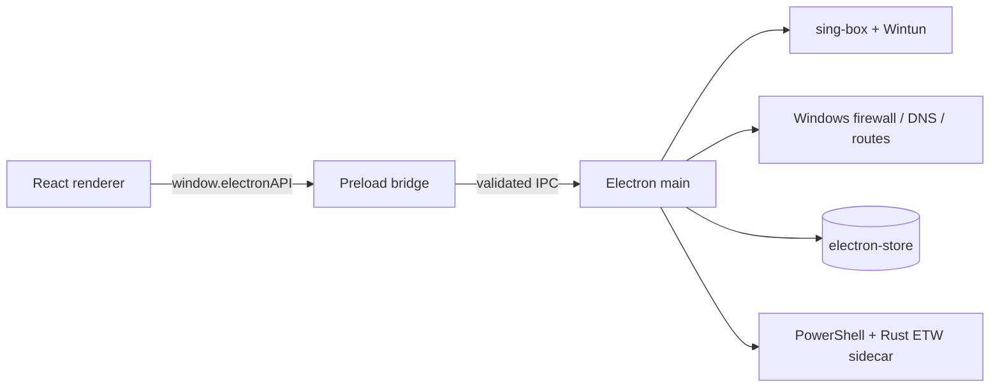

# Архитектура VPN Tunnel Enforcer

Этот раздел является стартовой точкой для ревью и дальнейшей разработки. Он описывает фактические границы приложения и порядок чтения кода. Сначала обновляйте эти документы при появлении нового runtime-слоя, IPC-домена или фонового сервиса.

## Быстрый маршрут чтения

1. [Карта модулей](./module-map.md) — где находится ответственность каждого слоя.
2. [Маршрут ревью](./review-guide.md) — в каком порядке проверять изменение и какие инварианты не потерять.
3. `src/shared/ipc-types.ts` — общие типы IPC.
4. `src/preload/index.ts` — публичный bridge renderer → main и runtime-валидация аргументов.
5. `src/main/index.ts` — жизненный цикл Electron, базовые IPC-обработчики и регистрация feature-модулей.
6. Нужный feature-модуль main и соответствующая страница/component в renderer.

## Runtime-контур

## Главные инварианты

- Renderer не вызывает Windows API, shell-команды или файловую систему напрямую.
- Любой новый IPC-метод проходит через preload и получает валидацию аргументов до `ipcRenderer.invoke`.
- Изменения состояния туннеля должны учитывать запуск, остановку, crash recovery и stale-process recovery.
- Изменения firewall, DNS, IPv6 и маршрутов должны иметь симметричный rollback и проверку результата.
- Секреты и VPN-ключи не попадают в UI-логи, диагностические ZIP и обычные сообщения ошибок.
- Feature-модуль владеет своими IPC-каналами и регистрацией; `src/main/index.ts` только связывает модули и управляет жизненным циклом приложения.

## Что пока намеренно не перемещено

`src/main/index.ts`, `src/main/tunController.ts` и `src/renderer/pages/Servers.tsx` остаются крупными файлами. Их безопаснее дробить отдельными изменениями с тестами на границе каждого extracted service/component. Физическое перемещение всех файлов одним коммитом создаёт лишний шум и усложняет последующее ревью.

